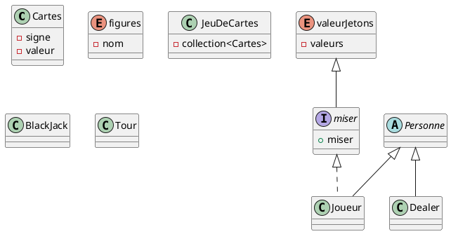

Editez de fichier de conception au format Markdown 

Vous intégrez des diagrammes UML ainsi :

``` 


```plantuml 
@startuml

class Cartes {
    - signe
    - valeur
}

enum valeurJetons {
    -valeurs
}

enum figures {
    - nom
}

class JeuDeCartes {
    - collection<Cartes>
}

interface miser implements valeurJetons {
    + miser
}

class BlackJack  {
}

class Tour {
}

abstract Personne {

}

class Joueur extends Personne implements miser {
}

class Dealer extends Personne {
}
@enduml
```

```

Attendus : 

- Un diagramme de classe
- Un diagramme de cas d'utilisation